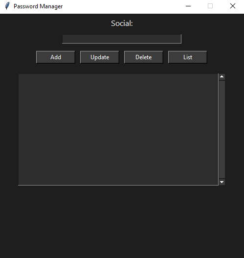

# 🔐 Password Manager (Tkinter + SQLite)

A simple and lightweight password manager built with Python's `tkinter` for the GUI and `sqlite3` for persistent local storage. Features a dark mode interface and supports saving, updating, listing, and deleting passwords for various social platforms.

---

## 📸 Preview

---

## 🚀 Features

- 🌓 Dark mode interface
- 🔐 Secure random password generation using `secrets`
- 💾 Local storage with SQLite
- 📋 Add, update, list, and delete passwords for social accounts

---

## 🛠️ Requirements

- Python 3.7+
- No external libraries needed

> Optional: For creating `.exe`, use `pyinstaller`

